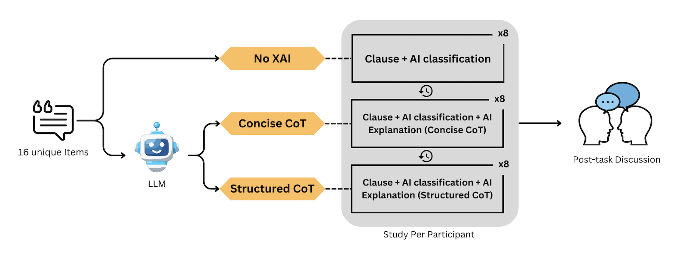

# Pilot Study on How Chain-of-Thought Affects Expert Performance in Human–AI Collaboration for Legal Tasks

[](https://opensource.org/licenses/BSD-3-Clause)

## 📌 Overview
This pilot study assesses the effect of different formatting of CoT as an explanation on legal expert performance and reliance in a human-AI collaborative decision-making system, and how useful these explanations are perceived to be. Two CoT-style explanations were evaluated with two legal expert participants in comparison with No-XAI as a baseline on an unfair ToS classification task, using 16 items from the LegalBench benchmark \citep{guha_legalbench_2023} analysed via a four-quadrant reliance framework. The study shows the indistinguishable effect of Concise Cot in comparison with No-XAI. However, the Structured CoT amplifies the AI prediction, regardless of its correctness: it helps when the AI is correct and harms when the AI is incorrect. The CoT explanations are considered useful regardless of their actual objective benefit, indicating a calibration gap between the perceived usefulness and participants' actual performance. The outcome of this pilot study provides early evidence that CoT format matters as much as CoT presence and motivates a large-scale study to validate these reliance patterns with statistical power.

---

## 📝 Study Framework

*Figure 1: The user study design*

---

## 📊 Results
![Research Overview] (./images/quadrantframework.png)
![Research Overview] (./images/usefulness.png)

## 🚀 Quick Start

### Installation
```bash
git clone [https://github.com/yourusername/your-repo-name.git](https://github.com/yourusername/your-repo-name.git)
cd your-repo-name
pip install -r requirements.txt
